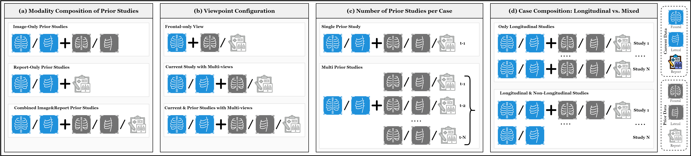
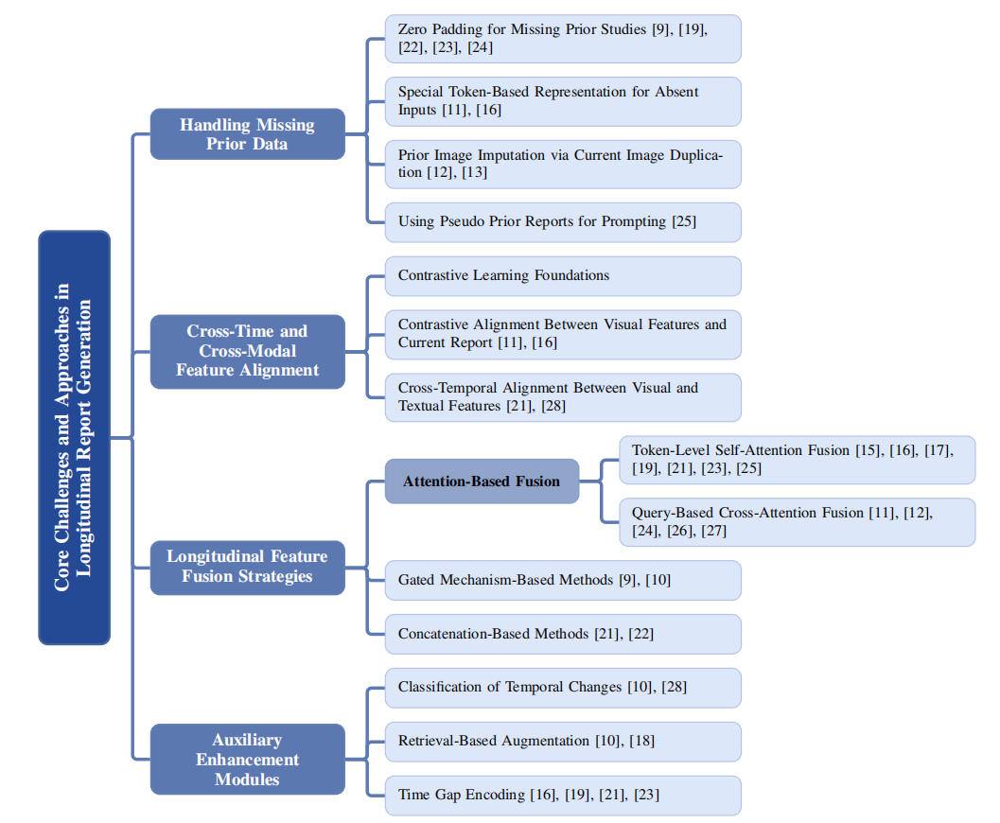

# Awesome Longitudinal Report Generation  <!-- omit in toc -->

## [A Survey of Longitudinal Report Generation]

This is a repository for organizing papers, codes and other resources related to Longitudinal Report Generation, particularly focusing on medical imaging and radiology report generation using temporal data.

Longitudinal Report Generation involves generating textual reports from sequences of medical images taken over time, leveraging temporal information to provide more accurate and comprehensive diagnoses.

## 📖 **The main structure of this survey!**

📂 **Datasets**

Strategies for constructing longitudinal datasets:
- **Modality Composition**: prior images, prior reports, or both  
- **Case Inclusion**: only longitudinal cases vs. mixed  
- **Number of Priors**: single prior vs. multiple temporal priors  
- **Multi-View**: frontal only vs. multi-view (frontal + lateral)  

  

⚡ **Core Challenges**

Longitudinal report generation introduces unique difficulties that go beyond single-image settings, requiring models to cope with incomplete data, misaligned features, and complex temporal reasoning.  
- **Missing priors** → zero-padding, placeholder tokens, pseudo-priors  
- **Feature misalignment** → contrastive learning across time & modalities  
- **Temporal fusion** → attention, gating, concatenation  
- **Auxiliary modules** → temporal change classification, retrieval-based augmentation, time-gap encoding  

  

#### :books: How to read?
The papers are organized by year and methodology approach. Each paper includes links to the original publication and code repository (when available). The papers are listed in chronological order from newest to oldest to track the evolution of the field.

#### :high_brightness: This project is still on-going, pull requests are welcomed!!

If you have any suggestions (missing papers, new papers, key researchers or typos), please feel free to edit and pull a request. Just letting us know the title of papers can also be a great contribution to us.

#### :star: If you find this repo useful, please star it!!!

## Papers

### Longitudinal Method

+ **DDaTR** [Dynamic Difference-aware Temporal Residual Network for Longitudinal Radiology Report Generation](https://arxiv.org/abs/2505.03401) (May 06, 2025)
  
  

+ **RADAR** [Enhancing Radiology Report Generation with Supplementary Knowledge Injection](https://arxiv.org/abs/2505.14318) (May 20, 2025)
  
  

+ **MedVersa** [A Generalist Foundation Model for Medical Image Interpretation](https://arxiv.org/pdf/2405.07988) (Jun 10, 2025)
  

+ **STREAM** [Spatio-Temporal and Retrieval-Augmented Modeling for Chest X-Ray Report Generation](https://ieeexplore.ieee.org/stamp/stamp.jsp?tp=&arnumber=10938723) (Mar 25, 2025)
  
  

+ **MLRG** [Enhanced Contrastive Learning with Multi-view Longitudinal Data for Chest X-ray Report Generation](https://arxiv.org/abs/2502.20056) (Feb 27, 2025)
  
  

+ **HC-LLM** [Historical-Constrained Large Language Models for Radiology Report Generation](https://arxiv.org/pdf/2412.11070) (Dec 15, 2024)
  
  

+ **LLM-RG4** [Flexible and Factual Radiology Report Generation Across Diverse Input Contexts](https://arxiv.org/abs/2412.12001) (Dec 16, 2024)
  
  

+ **Libra** [Leveraging Temporal Images for Biomedical Radiology Analysis](https://arxiv.org/abs/2411.19378v2) (Nov 28, 2024)
  
  

+ **HIST-AID** [Leveraging Historical Patient Reports for Enhanced Multi-Modal Automatic Diagnosis](https://arxiv.org/abs/2411.10684) (Nov 26, 2024)
  
  

+ **EVOKE** [Elevating Chest X-ray Report Generation via Multi-View Contrastive Learning and Patient-Specific Knowledge](https://arxiv.org/abs/2411.10224) (Nov 15, 2024)
  
  

+ **TiBiX** [Leveraging Temporal Information for Bidirectional X-Ray and Report Generation](https://link.springer.com/chapter/10.1007/978-3-031-72744-3_17) (Oct 09, 2024)
  
  

+ **MAIRA-2** [Grounded Radiology Report Generation](https://arxiv.org/pdf/2406.04449) (Sep 20, 2024)
  
  

+ **M4CXR** [Exploring Multi-task Potentials of Multi-modal Large Language Models for Chest X-ray Interpretation](https://arxiv.org/abs/2408.16213) (Aug 29, 2024)
  

+ **HERGen** [Elevating Radiology Report Generation with Longitudinal Data](https://arxiv.org/abs/2407.15158) (Jul 21, 2024)
  
  

+ **LGVT** [Enhancing Radiology Report Generation: The Impact of Locally Grounded Vision and Language Training](https://bmva-archive.org.uk/bmvc/2024/papers/Paper_857/paper.pdf) (2024)
  

+ **RECAP** [Towards Precise Radiology Report Generation via Dynamic Disease Progression Reasoning](https://arxiv.org/pdf/2310.13864) (Oct 21, 2023)
  
  

+ **LXRCXR** [Utilizing Longitudinal Chest X-Rays and Reports to Pre-Fill Radiology Reports](https://arxiv.org/abs/2306.08749) (Oct 10, 2023)
  
  

+ **CCLR** [Controllable Chest X-Ray Report Generation from Longitudinal Representations](https://arxiv.org/pdf/2310.05881) (Oct 09, 2023)
  

+ **CXRMate** [Longitudinal Data and a Semantic Similarity Reward for Chest X-Ray Report Generation](https://arxiv.org/abs/2307.09758) (Jul 19, 2023)
  
  

+ **BioVil-T** [Learning to Exploit Temporal Structure for Biomedical Vision–Language Processing](https://arxiv.org/pdf/2301.04558) (Mar 16, 2023)
  

+ **PriorRG** [Prior-Guided Contrastive Pre-training and Coarse-to-Fine Decoding for Chest X-ray Report Generation](https://arxiv.org/pdf/2508.05353) (Aug 7, 2025)
  
  

+ **DPE** [Disease probability-enhanced follow-up chest X-ray radiology report summary generation](https://www.nature.com/articles/s41598-025-12684-2) (Jul 24, 2025)
  

+ **Diff-RRG** [Longitudinal Disease-Wise Patch Difference as Guidance for LLM-Based Radiology Report Generation](https://link.springer.com/chapter/10.1007/978-3-032-04981-0_15) (Sep 20, 2025)
  
  

### Longitudinal-related Metrics

+ **Mrscore** [Mrscore: Evaluating radiology report generation with llm-based reward system](https://arxiv.org/abs/2404.17778) (Apr 27, 2024)
  

+ **Lunguage** [Lunguage: A Benchmark for Structured and Sequential Chest X-ray Interpretation](https://arxiv.org/abs/2505.21190) (May 27, 2025)
  

+ **FineRadScore** [FineRadScore: A Radiology Report Line-by-Line Evaluation Technique Generating Corrections with Severity Scores](https://arxiv.org/abs/2405.20613) (May 31, 2024)
  

+ **Green** [Green: Generative radiology report evaluation and error notation](https://arxiv.org/abs/2405.20613) (May 6, 2024)
  
  

  
*This list is continuously updated. Please feel free to contribute by opening issues or pull requests!*
